# cockpit-podman (podorel-ui)

A [Cockpit](https://cockpit-project.org/) page for managing
[Podman](https://podman.io/) containers, pods, images, volumes, networks and
secrets on one host.

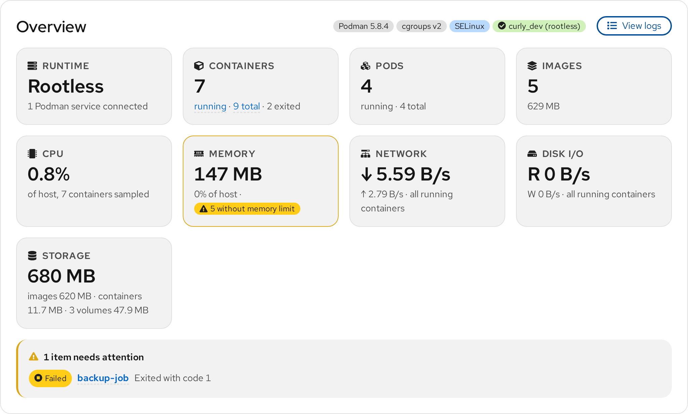

This is a fork of
[cockpit-project/cockpit-podman](https://github.com/cockpit-project/cockpit-podman).
The `podorel-ui` branch adds an overview, pod cards, compose stacks, image
update and vulnerability checks, diagnostics and a number of dialogs on top of
the upstream page, and is rebased on upstream `main` regularly. Everything
talks to Podman through its [REST API](https://docs.podman.io/en/latest/_static/api.html)
over the Cockpit bridge; there is no agent, no database and no separate login.

## Contents

- [Quick install on Fedora](#quick-install-on-fedora)
- [Overview](#overview)
- [Pods and compose stacks](#pods-and-compose-stacks)
- [Containers](#containers)
- [Images](#images)
- [Volumes, networks and secrets](#volumes-networks-and-secrets)
- [Logs](#logs)
- [Diagnostics](#diagnostics)
- [Requirements](#requirements)
- [Development](#development)
- [Upstream](#upstream)

## Quick install on Fedora

Everything below is copy-and-paste. Path A gives the page to your own user
only and needs no root. Path B installs it for every user.

**1. Install Cockpit and Podman and enable their sockets**

    sudo dnf install cockpit cockpit-podman podman nodejs make git
    sudo systemctl enable --now cockpit.socket podman.socket
    systemctl --user enable --now podman.socket

The packaged cockpit-podman can stay; this branch takes priority over it.

Optional, only for the features that use them:

    sudo dnf install podman-compose skopeo    # compose stacks, image update checks

Trivy, for vulnerability scans, is not in Fedora's repositories; see
[trivy.dev](https://trivy.dev/latest/getting-started/installation/).

**2. Get the source and build it**

    git clone https://github.com/curly-hub/cockpit-podman
    cd cockpit-podman
    git checkout podorel-ui
    make

**3a. Path A: install for your own user (no root)**

    make devel-install

Open <https://localhost:9090>, log in as yourself and click **Podman**.
Reload the page if it was already open. Other users still see the packaged
page. `make devel-uninstall` removes the link again.

**3b. Path B: install for every user**

    sudo dnf install gettext
    sudo make install

The page lands in `/usr/local/share/cockpit/podman`, which Cockpit prefers
over the packaged copy in `/usr/share`. Reload Cockpit. To remove it, delete
that directory.

**Updating later**

    cd cockpit-podman
    git pull
    make            # Path A picks this up on reload; Path B needs sudo make install again

**If the Podman page shows an error instead of the overview**, the page
itself says which step failed (socket inactive, masked, permission denied)
and offers a button to fix it. On a fresh Fedora the usual cause is the user
socket not being enabled, which step 1 covers.

## Overview

The card at the top answers four questions: is Podman working, what is
running, is anything wrong, and where to click next. It shows the runtime
mode and Podman version, the socket state per owner, counts of containers,
pods, images and volumes, CPU, memory, network and disk I/O summed over the
running containers, storage use, and a list of what needs attention right
now: unhealthy containers, restart loops, failed exits, degraded pods and
containers without a memory limit. Each entry links to the container or pod.

## Pods and compose stacks

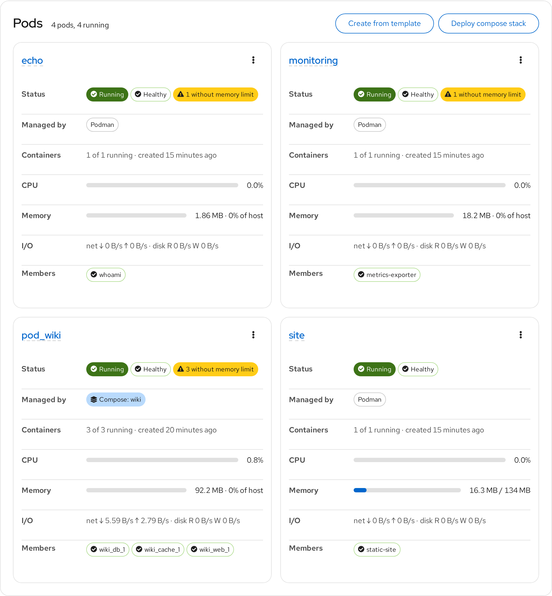

Every pod is a card with its health, who manages it, member containers, CPU
and memory bars, network and disk rates, and a kebab with start, stop,
restart, logs and delete. Pods created by `podman-compose` are recognised
from their container labels and show the stack name; their kebab adds
"Recreate stack" and "Pull and recreate stack", which run `podman-compose`
in the project's own directory.

**Deploy compose stack** takes pasted YAML or an existing compose file,
validates it (YAML, `podman-compose config`, and host ports already in use),
pulls the images and brings the stack up while streaming the output. Pasted
YAML is saved as `~/containers/<project>/compose.yaml` so the stack can be
updated later.

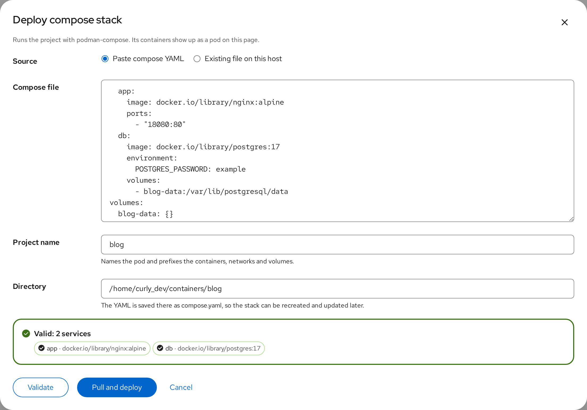

**Create from template** offers a catalog of common services: nginx serving
a directory, a whoami echo server, PostgreSQL, MariaDB, Redis, Python's file
server and a Node.js app. A template carries the image, command, ports,
environment, storage, memory limit, restart policy and health check; the
dialog asks only for what varies, such as the pod name, host ports, required
passwords and host directories. The filled-in form can be saved as a template
of your own; saved templates live in `~/.config/cockpit-podman/templates.json`.

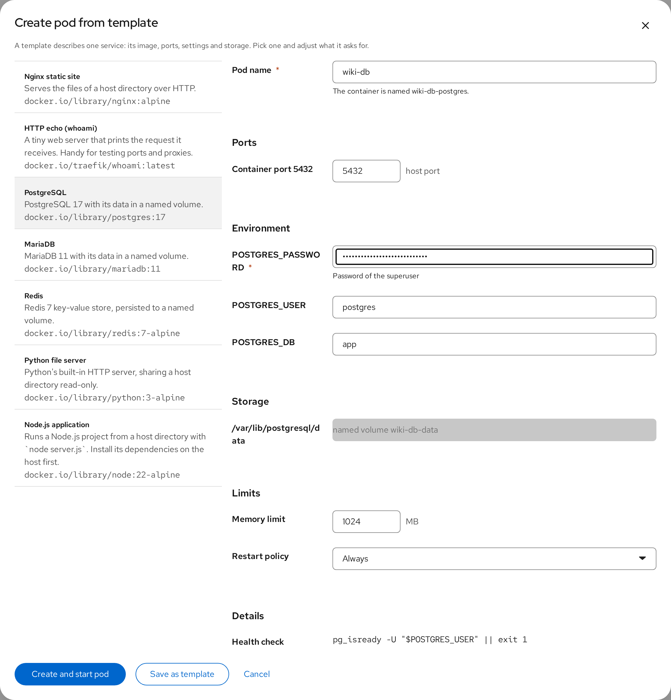

## Containers

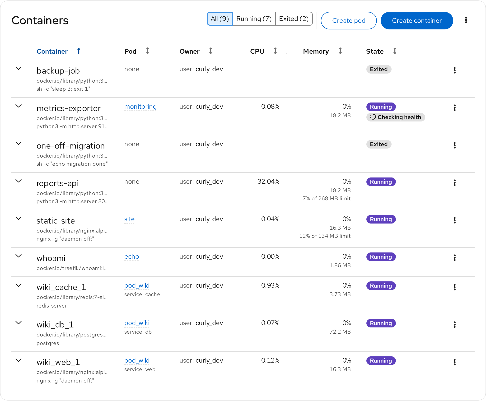

One flat table with a Pod column, the compose service name under it, and
state filters with counts: all, running, unhealthy, exited, and containers
running an older image than the one on disk. Each row expands into the
upstream Details, Integration, Logs and Console tabs plus two new ones.

**Resources** keeps ten minutes of history per container: CPU, memory
against its limit, network and disk rates, and process count, with peaks.

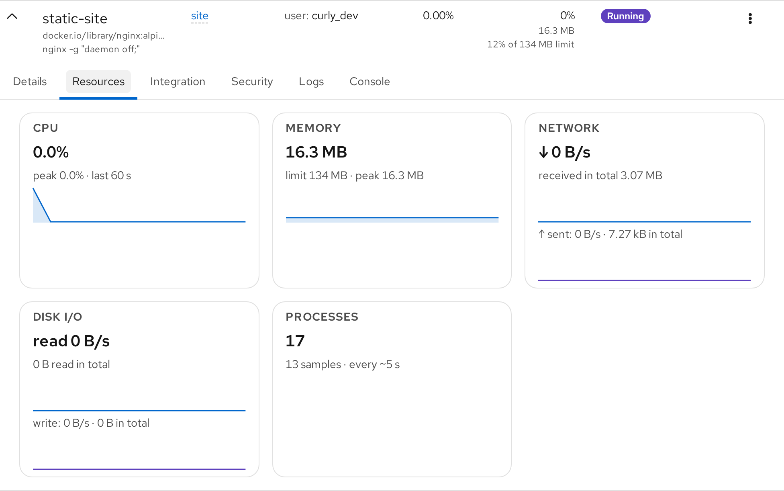

**Security** lists the facts that matter: rootless or rootful, privileged,
the user inside and on the host, read-only root filesystem, network, PID,
IPC and user namespaces, SELinux label, seccomp profile, no-new-privileges,
restart policy, published ports, host devices and bind mounts. Anything
risky, such as a privileged container, a host namespace or a writable mount
of a system directory, gets a warning label. There is no score.

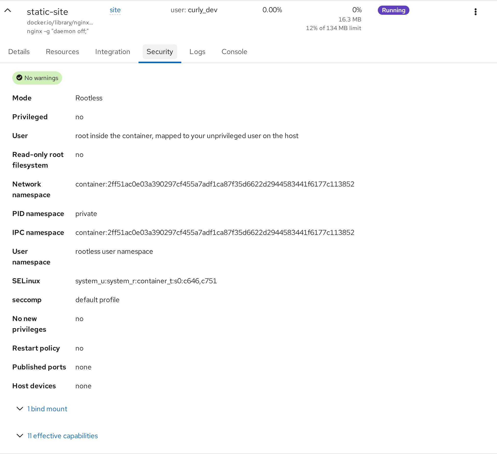

## Images

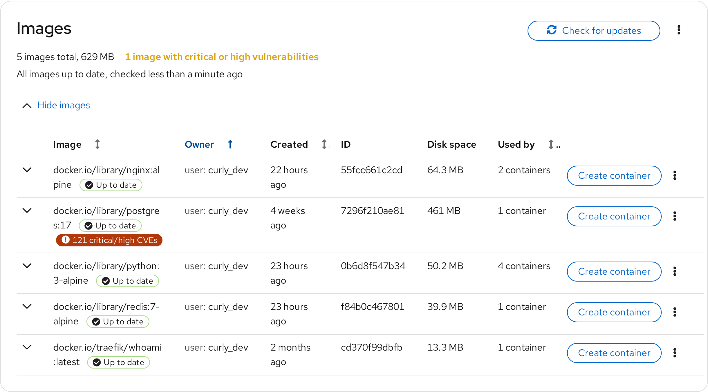

The upstream list, with three additions.

**Check for updates** compares each image's digest with the registry through
`skopeo inspect` and labels the row "Update available" or "Up to date", with
an inline Pull. Containers still running the old image get a "Newer image
pulled" badge and, for compose containers, a "Recreate with new image"
action.

**Scan for vulnerabilities** runs [Trivy](https://trivy.dev/) against the
image in Podman's storage, per image or for all of them. The row gets a
label with the number of critical and high CVEs, the card header counts
affected images, and a Vulnerabilities tab lists every finding with
severity, package, installed and fixed version and a link to the advisory,
with a severity filter. An end-of-life base OS is called out. Counts only,
no score.

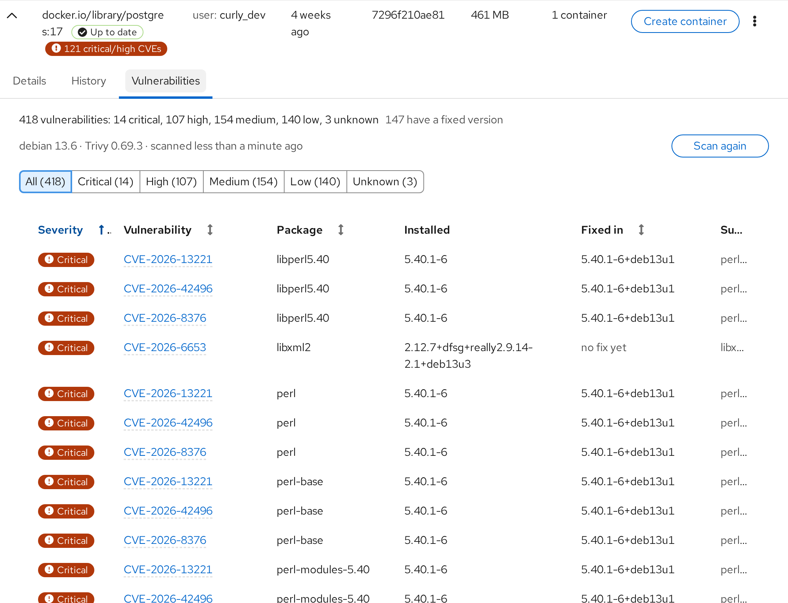

**Build image from Containerfile** runs `podman build` from a Containerfile
written in the dialog or an existing directory. Before building, a review
lists the base images and points out what usually ends up in images by
accident: credential-looking `ENV` and `ARG` values, copied key or `.env`
files, downloads piped into a shell, and a missing `USER`. The notes never
block the build.

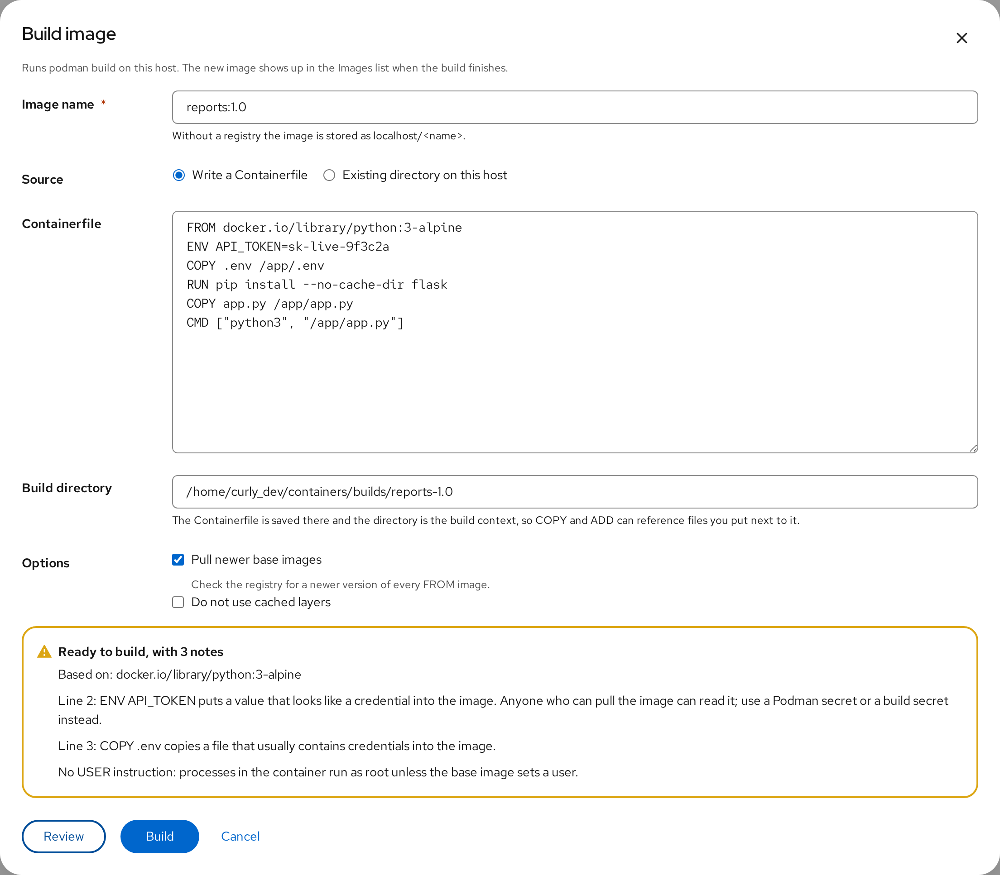

## Volumes, networks and secrets

Three cards with the same idea: what exists, who uses it, and what nothing
uses any more.

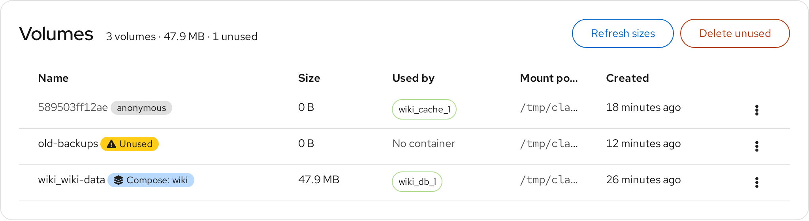

Volumes show their size from `podman system df`, the containers mounting
them, compose ownership, anonymous volumes, and an "Unused" label; unused
ones can be deleted one by one or pruned together.

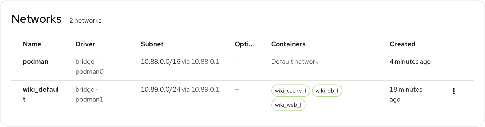

Networks show driver, interface, subnet and gateway, options such as
internal or IPv6, and the containers attached; pod members appear on their
infra container's networks.

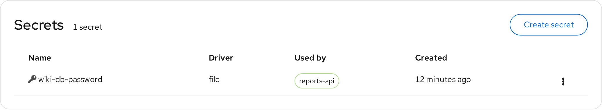

Secrets show their driver, age and the containers that mount them. "Create
secret" takes a typed value or a file on the host. Podman never returns a
secret's value, so the card only ever shows metadata.

## Logs

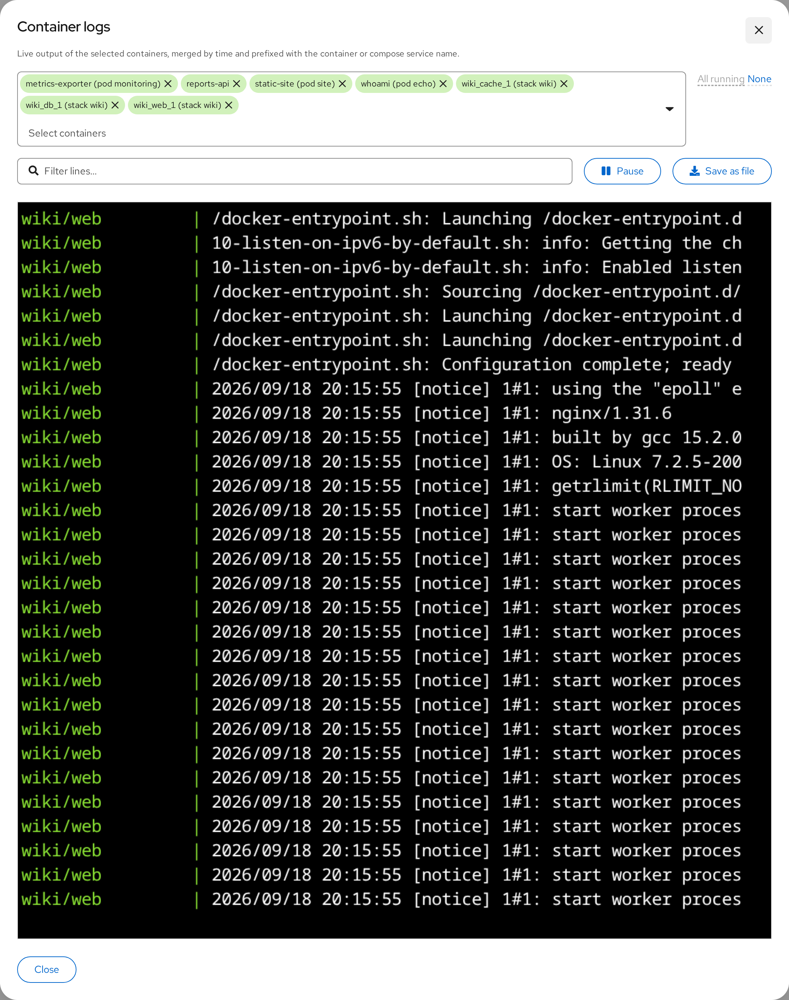

"View logs" on the Overview card opens a page-wide log view. Pick any
containers across pods and owners; running ones are preselected. Lines are
read through the REST API, merged by timestamp and prefixed with the compose
service or container name, then followed live. The view can be filtered by
text, paused and resumed without losing output, and saved as a file. Every
pod card has the same view for its own members.

## Diagnostics

When a Podman service is unavailable, the page explains why instead of a
generic "Podman service failed": not installed, socket missing, unit
inactive or masked, permission denied, or the API not responding. Each state
has the matching recovery action, such as starting, enabling or unmasking
the socket, plus a link to the journal.

## Requirements

- Cockpit and Podman 4.0 or newer (5.x recommended) on Fedora or another
  systemd-based distribution.
- Optional, for the features that use them: `podman-compose` (stacks),
  `skopeo` (image update checks), `trivy` (vulnerability scans).

## Development

`make watch` rebuilds `dist/` on every source change; with Path A installed,
reloading the page shows the result. `make rpm` builds an RPM.

### Checks

    npm run eslint
    npm run stylelint
    codespell src

The old `.jsx` files carry a large number of pre-existing strict-mode
TypeScript errors; only the `.ts` and `.tsx` files are expected to be clean
under `npx tsc --noEmit`.

### Screenshots

The images in `screenshots/` were taken against a throwaway rootless Podman
instance with its own storage and socket, served through
`cockpit-ws --local-session`, so they show demo workloads rather than a real
host.

## Upstream

Bug reports and features that make sense for every Cockpit user belong in
[cockpit-project/cockpit-podman](https://github.com/cockpit-project/cockpit-podman).
To stay current:

    git fetch upstream && git rebase upstream/main

See [HACKING.md](./HACKING.md) for the upstream development notes.

## License

LGPL-2.1-or-later, like upstream cockpit-podman.
